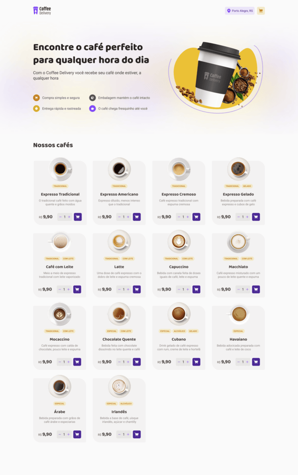

# Coffee Delivery

Coffee Delivery is a web commerce for a coffe shop

## Requeriments
You need to have Node installed locally
## Usage

```bash
git clone https://github.com/tiago0214/coffee-delivery.git

cd coffee-delivery

npm install

npm run dev
```


# Project Preview



#### All features that you'll see on the website is implemented

### technologies

- React
- StyledComponents

Project Figma:
https://www.figma.com/design/54MmdPCzvbGfV6Rt0037Eh/Coffee-Delivery-%E2%80%A2-Desafio-React-(Copy)?m=auto&t=u28v5HhflncYTFRM-1